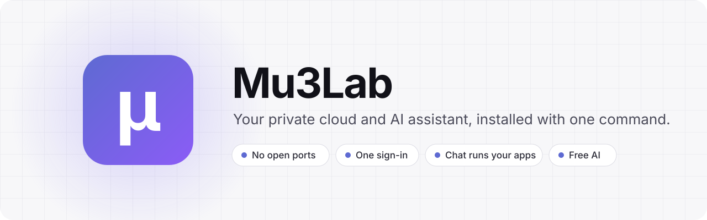
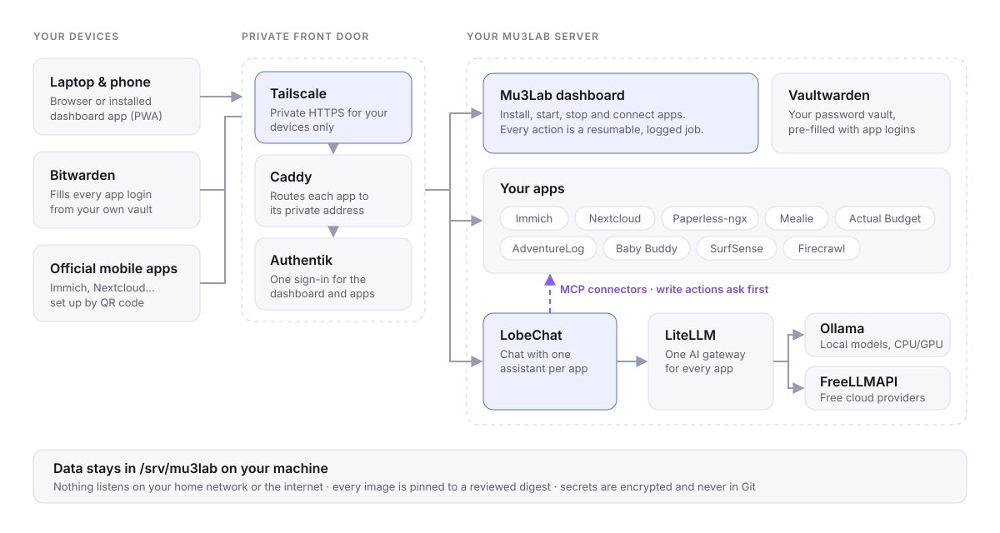

<p align="center">
  
</p>

<p align="center">
  <a href="https://github.com/dcazes/Mu3Lab/actions/workflows/ci.yml"></a>
  <a href="LICENSE"></a>
  
  
</p>

<p align="center">
  <b>Mu3Lab turns a Linux computer into a private home cloud.</b><br>
  Photos, files, documents, recipes, budgets and an AI assistant that can use them all,<br>
  behind one sign-in, reachable from your devices anywhere, with no ports open to the internet.
</p>

<p align="center">
  <a href="#-quick-start">Quick start</a> ·
  <a href="#-why-mu3lab">Why Mu3Lab</a> ·
  <a href="#-whats-included">What's included</a> ·
  <a href="#-how-it-works">How it works</a> ·
  <a href="#-security-model">Security</a> ·
  <a href="#-roadmap">Roadmap</a>
</p>

<!--
  SCREENSHOT: hero image goes here. Save a 1440×900 capture of Home in both themes
  as docs/images/screenshots/home-dark.png and home-light.png, then uncomment:

<p align="center">
  <picture>
    <source media="(prefers-color-scheme: dark)" srcset="docs/images/screenshots/home-dark.png">
    
  </picture>
</p>
-->

---

## ⚡ Quick start

```bash
git clone https://github.com/dcazes/Mu3Lab.git
cd Mu3Lab
./install.sh
```

That's the whole install. Here is what happens:

1. **Enter your computer password once.** Setup installs Docker and Tailscale. UI builds run in a pinned Node container.
2. **Choose an email and one password for Mu3Lab.** The same password signs you in to the dashboard and unlocks your password vault.
3. **Approve this computer in Tailscale.** Your browser opens the page, and the installer carries on by itself once you approve.
4. **Walk away.** That's every question, all in the first few minutes. The large downloads run unattended afterwards.
5. **Sign in.** When setup is done, the dashboard opens in your browser. Sign in to finish. Your app logins are already in your vault, and the dashboard's Home page lists what to do next.

> [!TIP]
> To update, open **Settings → System → Mu3Lab updates** in the dashboard. The updater offers normal release tags and verifies their assets. Development checkouts stay manual: update the checkout and re-run `./install.sh` when you intend to apply it. Finished steps are skipped and changed code is rebuilt. `make check` prints a read-only readiness report.

**You need:** a desktop or laptop running Ubuntu 22.04+, Debian 12+ or a derivative such as Linux Mint (x86-64 or arm64), with at least **8 GB of RAM** and **20 GB of free disk space**, plus a free [Tailscale](https://tailscale.com) account. An NVIDIA or AMD GPU is optional; Mu3Lab detects it and uses it for local AI.

---

## ✨ Why Mu3Lab

Most homelab dashboards are app stores: they start containers for you and leave the rest to you. Mu3Lab covers the rest too: private access, sign-in, passwords, AI and honest status, **already wired together**.

<table>
<tr>
<td width="50%" valign="top">

### 🔒 Private by default
Every app gets a private HTTPS address on your Tailscale network. **Nothing listens on your home network or the internet.** No port forwarding, no dynamic DNS, no exposed admin pages. Your phone reaches your photos from anywhere, and no one else can reach them at all.

</td>
<td width="50%" valign="top">

### 🔑 One sign-in, one password
Authentik, an identity server, is set up for you and connected to each app with that app's best method: native single sign-on, trusted headers, or a sign-in gate in front of it. You sign in once. You don't make a separate account for every app.

</td>
</tr>
<tr>
<td valign="top">

### 🗝️ Your passwords, handled
Mu3Lab installs **Vaultwarden**, a self-hosted server that works with the Bitwarden apps, and saves every app login into it. If you use Chrome, Chromium or Brave, the Bitwarden extension is added already pointed at your vault, so you only sign in.

</td>
<td valign="top">

### 🤖 A chat assistant that uses your apps
LobeChat comes with **one assistant per installed app**. Ask it to plan meals in Mealie, find a receipt in Paperless, check your budget in Actual or search the web with Firecrawl. It connects through reviewed MCP connectors, and **chat writes are unavailable until the gateway can verify approval for each call**.

</td>
</tr>
<tr>
<td valign="top">

### 💸 Free AI, without the setup
Paste free API keys from providers like Google AI Studio, Groq or NVIDIA, and Mu3Lab checks them and routes chat through them with automatic failover. Local models run on your own hardware through Ollama, on CPU or GPU. One gateway (LiteLLM) serves every app.

</td>
<td valign="top">

### ✅ Status you can trust
An app shows as ready only after its container is healthy, its private address answers and its sign-in works. Every action (install, start, stop, connect) runs as a resumable, logged job that picks up where it left off after a restart. **The dashboard never shows a green check it hasn't verified.**

</td>
</tr>
<tr>
<td valign="top">

### 📦 Curated, not a free-for-all
Every app is reviewed before it ships: pinned image digests, a sign-in method, health checks, a storage plan and resource guidance. Arbitrary Docker projects are never treated as trusted apps. You get fewer apps, and each one works properly.

</td>
<td valign="top">

### 🧭 Built for people, not just sysadmins
The dashboard is clean and fast, with light and dark themes, a <kbd>Ctrl</kbd>+<kbd>K</kbd> command palette, and a phone-installable web app. Each app's page shows its official mobile apps with a QR code for the server address. The technical detail is still there, in an Advanced tab.

</td>
</tr>
</table>

### How it compares

| | **Mu3Lab** | **Typical app-store homelab dashboards** |
|---|---|---|
| Remote access | Private Tailscale HTTPS for every app, built in | Port forwarding or a reverse proxy you configure |
| Sign-in | One account across apps, wired up automatically | A separate login for each app |
| Passwords | Vault created and filled with every app login | Up to you |
| AI assistant | A chat assistant per app for reads; chat writes currently unavailable | None, or a separate project |
| AI models | Free cloud providers plus local models, with automatic failover | Bring your own |
| App catalog | Curated and reviewed, pinned to digests, one integration contract per app | Large, community-submitted |
| Health | "Ready" means health, route and sign-in all verified | "Running" means the container started |
| Removal | `./uninstall.sh` removes everything it added, and `--dry-run` shows what first | Varies |

<sub>Some projects offer one or two of these, such as built-in SSO or a VPN add-on. What sets Mu3Lab apart is that all of them are on by default and work together from the first install.</sub>

---

## 🖼️ Tour

<!--
  SCREENSHOTS: capture these at 1440×900 (dark theme reads best on GitHub),
  save them under docs/images/screenshots/, then uncomment the table below.

  apps.png               /apps                     Installed apps with status and sign-in type
  chat-integrations.png  /settings/integrations    Apps connected to chat, with per-tool permissions
  ai-providers.png       /settings/ai              Free AI providers, verified and routed
  install.png            /apps/discover → Add      Install plan with sizes and parallel downloads
  app-devices.png        /apps/immich/devices      Official mobile apps with QR code
  mobile-home.png        Home on a phone (390×844)

<table>
<tr>
<td width="50%"><p align="center"><b>Apps.</b> Install, start and stop, with honest status.</p></td>
<td width="50%"><p align="center"><b>Chat integrations.</b> Connected for you, and you control each tool.</p></td>
</tr>
<tr>
<td><p align="center"><b>AI providers.</b> Paste a free key and it's checked and routed.</p></td>
<td><p align="center"><b>Installs.</b> See the download size first, then fetch apps in parallel.</p></td>
</tr>
<tr>
<td><p align="center"><b>Your devices.</b> Official apps, set up by QR code.</p></td>
<td><p align="center"><b>On your phone.</b> Install it as an app from the browser.</p></td>
</tr>
</table>
-->

> 📸 Screenshots coming soon.

---

## 📦 What's included

### Installed for you

| | App | What it does |
|---|---|---|
| 🛡️ | **Tailscale** | Private, encrypted access from your own devices, from anywhere |
| 🚦 | **Caddy** | Gives each app its own private HTTPS address |
| 🔑 | **Authentik** | One account and sign-in for the dashboard and your apps |
| 🗝️ | **Vaultwarden** | Your password vault, compatible with every Bitwarden app |
| 💬 | **LobeChat** | Chat workspace with an assistant for each of your apps |
| 🔀 | **LiteLLM** | One AI gateway for chat and embeddings |
| 🆓 | **FreeLLMAPI** | Routes chat to free cloud AI providers, with failover |
| 🦙 | **Ollama** | Local AI models and embeddings, on CPU, NVIDIA or AMD |
| 🕷️ | **Firecrawl** | Turns web pages into clean text so chat can research the web |

### Add with one click

| | App | What it does | Sign-in | Chat |
|---|---|---|:---:|:---:|
| 📷 | **[Immich](https://immich.app)** | Photo and video library with phone backup, face recognition and smart search | SSO | ✅ |
| ☁️ | **[Nextcloud](https://nextcloud.com)** | Files, calendar and contacts, synced across devices. Its calendar also feeds your Home agenda | SSO | ✅ |
| 📄 | **[Paperless-ngx](https://docs.paperless-ngx.com)** | Scans and files paperwork into a searchable archive with OCR | SSO | ✅ |
| 🍳 | **[Mealie](https://mealie.io)** | Recipes, meal plans and shopping lists | SSO | ✅ |
| 💰 | **[Actual Budget](https://actualbudget.org)** | Envelope budgeting, accounts and reports | SSO | ✅ |
| 🗺️ | **[AdventureLog](https://adventurelog.app)** | Travel journal and trip planner with maps | SSO | ✅ |
| 🔬 | **[SurfSense](https://github.com/MODSetter/SurfSense)** | AI research workspace with cited answers | Gated + own login | ✅ |
| 👶 | **[Baby Buddy](https://docs.baby-buddy.net)** | Shared tracker for feeding, sleep, diapers and growth | SSO | Manual |
| 🥫 | **[Grocy](https://grocy.info)** | Pantry stock, expiry dates, shopping lists and chores | SSO | ✅ |

<sub><b>SSO</b>: you're signed in automatically through Authentik. <b>Gated + own login</b>: Authentik guards the door, and the app keeps its own account, which Vaultwarden can fill. <b>Chat</b>: LobeChat can use the app through a reviewed MCP connector that Mu3Lab sets up.</sub>

**Supported free AI providers:** Cerebras · Google AI Studio · Groq · Hugging Face · NVIDIA · OpenRouter · Mistral · Zhipu

---

## 🧩 How it works

<p align="center">
  
</p>

- **One front door.** Tailscale Serve accepts private HTTPS from your tailnet and forwards only to Caddy on loopback. Containers and the control plane publish no LAN-facing ports.
- **One folder per app.** `apps/<app>/app.yaml` declares everything about an app: its address, sign-in method, generated settings, chat assistant and connectors, and the shared rules it follows. Image versions live only in that folder's `docker-compose.yml`. The dashboard's copy and state come from it, so the UI can't drift from reality.
- **One private state store.** Numbered migrations manage `state/mu3lab.db`; a single private encryption key protects scoped credentials. App ownership, jobs and personal checklist progress share this store. Preserve the database and key together.
- **Shared status.** The worker observes apps and the host; page loads read its saved snapshot. Phone and laptop see the same app health, and the dashboard warns when observations are old.
- **Durable jobs.** The FastAPI control plane queues every action as a leased, resumable SQLite job. A background worker runs it, reclaims interrupted work after a reboot and redacts secrets from logs.
- **Typed interfaces.** Python API models generate the dashboard types, and CI catches mismatches. App setup uses shared rules and supported external interfaces. See [Architecture](docs/architecture.md).
- **Connectors that follow their app.** MCP connectors start after their app is healthy and stop before it stops. A connector counts as live only after its credentials, health check and tool discovery all pass.

---

## 🛡️ Security model

- **No public exposure.** Apps are reachable only from devices on your Tailscale network. Reusable Tailscale auth keys are never accepted.
- **Forged identities are ignored.** The control plane trusts Authentik identity headers only when they arrive with a shared proxy token, and every change needs a same-origin request and a CSRF token bound to your session.
- **Chat can't touch the platform.** Only application data is exposed to chat. Vaultwarden, Authentik, Docker and host operations are never offered as tools, and the gateway currently blocks all chat writes.
- **Pinned supply chain.** Every image is pinned to an immutable digest. Apps move only to versions the maintainer has tested and approved, and only when you choose to update, with a backup first. See [App updates](docs/app-updates.md).
- **Data outside Git.** Everything lives under `/srv/mu3lab`. The repository holds definitions and safe defaults, never app data, backups or unencrypted secrets.

<details>
<summary><b>About the "Managed by your organization" browser notice</b></summary>
<br>

To add Bitwarden to Chrome, Chromium or Brave, setup writes a browser policy that installs the extension and sets its server address, and nothing else. Because it is a policy, the browser shows "Managed by your organization", and Bitwarden can be turned off but not removed. `./uninstall.sh` deletes the policy, and the browser then removes the extension.

</details>

<details>
<summary><b>Where your data lives</b></summary>

```text
/srv/mu3lab/
├── data/       app databases, uploads and media
├── backups/    local encrypted backup repository (planned)
├── secrets/    generated credentials, never in Git
├── runtime/    job queue, event log and control-plane state
└── projects/   generated per-app Compose projects
```

</details>

---

## 🧹 Uninstall

```bash
./uninstall.sh --dry-run      # show what would be removed
./uninstall.sh                # remove Mu3Lab and all of its data
./uninstall.sh --everything   # also remove Docker, Tailscale and NVIDIA container support
```

> [!WARNING]
> `--everything` removes Docker **and everything stored in it**, including containers that aren't part of Mu3Lab. Run it with `--dry-run` first.

Uninstall never touches system Python, GPU drivers or base packages.

---

## 🗺️ Roadmap

Mu3Lab is in active development, and the core platform, AI slice and app catalog listed above work today.

- [x] One-command, resumable installer with a guided Tailscale step
- [x] Authentik SSO wired into every app, plus a pre-filled Vaultwarden vault
- [x] AI slice: LobeChat, LiteLLM, FreeLLMAPI and Ollama, with GPU detection
- [x] Per-app chat assistants through reviewed MCP connectors (reads; chat writes disabled)
- [x] Parallel image downloads with size estimates before install
- [x] Encrypted local backups of catalog apps, with guided restore
- [x] One-click updates to tested versions, with a backup first and automatic rollback
- [x] Update Mu3Lab itself from the dashboard
- [ ] Scheduled and off-device backups, and backups of the core platform
- [ ] More curated apps

> [!NOTE]
> Backups cover catalog apps and run when you ask (and before every update); they are not scheduled yet. The core platform, including your Authentik sign-in accounts, is not backed up yet, so also keep your own copy of `/srv/mu3lab/data`. Run `make pause` first and `make resume` afterwards, because a copy of a running database may not restore. They stop and start only Mu3Lab's containers.

---

## 🛠️ Development

Use an isolated checkout for changes. Python and the standalone Bitwarden CLI
use the pinned toolchain; dashboard preview, checks and builds use Docker.

| Command | Purpose |
|---|---|
| `make dev-setup` | Prepare development tools and build the UI |
| `make ui-dev` | UI preview with automatic refresh on loopback |
| `make api-schema` | Regenerate OpenAPI and dashboard API types after Python model changes |
| `make test` | Python and dashboard tests, with UI checks in the Node container |
| `make verify` | Lint, type checks, tests and production UI build |
| `make format` | Python and UI formatting |

See [Development](docs/development.md) for isolated backend setup and release
checks, and [Acceptance](docs/acceptance.md) for the real-device test journey.

The [2026-10-07 project review and change tracker](docs/reviews/2026-10-07-project-review.md)
assesses the concept, architecture and implementation, with prioritized fixes,
implementation steps, acceptance criteria and a supporting evidence record.

| Path | What's there |
|---|---|
| [`ctl/store/`](ctl/store), [`ctl/status/`](ctl/status) | Shared private state, encrypted credentials and worker health observations |
| [`ctl/engine/`](ctl/engine), [`ctl/rules/`](ctl/rules), [`ctl/integrations/`](ctl/integrations) | Common installation steps, reusable app behavior and supported external clients |
| [`ctl/api/`](ctl/api) | Typed FastAPI control plane. `security.py` resolves the caller's Authentik identity; `routes/` has one router per dashboard area under `/api/v1` |
| [`ctl/service_ops.py`](ctl/service_ops.py), [`ctl/lifecycle/`](ctl/lifecycle) | Lifecycle jobs run by the worker, and the steps they sequence |
| [`dashboard/src/`](dashboard/src) | React + TypeScript dashboard: `api/`, `components/`, `features/<area>/`, `shell/` |
| [`apps/`](apps) | One folder per app: `app.yaml` (validated by `ctl/manifest/`), its Compose file, and reviewed chat connectors under `connectors/` |
| [`platform/`](platform) | Images Mu3Lab builds itself: the chat tool gateway and the generic connector adapter |

Tests never touch the host's `/srv/mu3lab`: [`tests/__init__.py`](tests/__init__.py) points `MU3LAB_RUNTIME_ROOT` at an empty temporary directory. CI runs ruff, mypy, the Python and dashboard test suites, ESLint, Prettier, the dashboard build, generated API contract checks, YAML and Compose validation, and a secret scan.

---

## 📄 License

Mu3Lab is licensed under the [GNU AGPL-3.0-or-later](LICENSE). Each curated app keeps its own license and operational requirements.

<p align="center"><sub>Built for people who want their own cloud without taking on a second job to run it.</sub></p>
