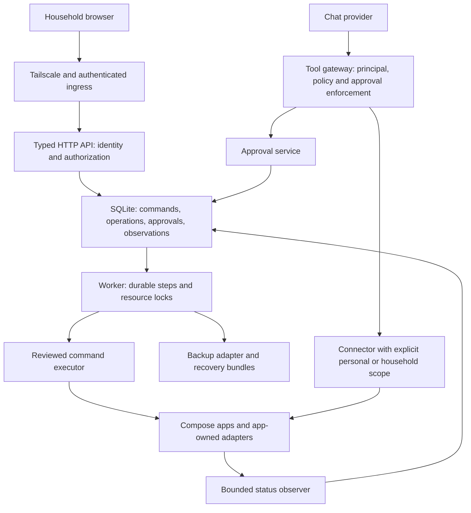

# Mu3Lab project review and implementation plan

Review date: **2026-10-07 (America/Toronto)**

Baseline: **`ca299152c3a08a1ee0c7d4695e9e8938f4a880e8`**, branch `main`

Scope: concept, architecture, security boundaries, implementation, operational recovery, dashboard, tests, release process, and existing expansion plans.

Deliverable status: **review completed; priority security implementation started on 2026-10-08**. Progress and acceptance limits are recorded in [the implementation record](2026-10-08-priority-security-implementation.md). No application fixes, installations, migrations, or production operations were performed for this review.

## Navigation

- [Assessment and verification](#1-assessment)
- [Concept review](#2-concept-review)
- [Target architecture](#3-architecture-assessment-and-target)
- [Prioritized change tracker](#4-prioritized-change-tracker)
- [Security and tool execution](#5-security-and-tool-execution-findings)
- [Workflows, storage and recovery](#6-workflow-storage-and-recovery-findings)
- [Status and dashboard](#7-status-dashboard-and-operational-behavior)
- [Architecture and implementation quality](#8-platform-architecture-and-implementation-quality)
- [Verification and product obligations](#9-verification-delivery-and-product-obligations)
- [App acceptance inventory](#10-app-by-app-acceptance-inventory)
- [Delivery sequence](#11-delivery-sequence-and-reviewable-work-packages)
- [High-risk test matrix](#12-test-design-for-the-highest-risk-changes)
- [Open decisions](#13-decisions-and-remaining-investigations)
- [Evidence and reproductions](2026-10-07-evidence.md)

## 1. Assessment

**Continue the project, but make trustworthy operation the next milestone.** The useful product is a household cloud whose applications, identity, storage, and assistant work together. Its distinguishing value is the reduction in ongoing administration. The catalog size and number of integrations are secondary to being able to explain who can access data, what a change will do, whether it succeeded, and how to recover.

The implementation is substantially more developed than a collection of Compose files. It has validated manifests, shared installation rules, typed API contracts, encrypted credentials, durable job records, an independent status observer, reviewed connector tools, and meaningful automated tests. These are good foundations to preserve.

However, several central promises are stronger than the current guarantees:

- The bootstrap ingress attaches the trusted proxy token before authenticating callers, while preserving caller-supplied identity headers.
- Enabled chat write tools execute without gateway verification of approval for that call. The dashboard console's confirmation path does not protect chat calls.
- A network failure can cause a write tool to be sent twice.
- Durable jobs are reclaimed, but maintenance operations do not persist enough recovery state to safely resume every destructive phase.
- Image version records do not uniquely identify complete deployments, so rollback can combine old data/images with new configuration.
- Current backups do not provide complete machine-loss recovery, including the credentials needed to unlock them.
- A failed private-route probe can still produce a ready service.

These are release blockers or high-priority reliability defects, even though the existing automated checks pass.

### 1.1 What this review establishes—and what it does not

**Established:** repository behavior at the baseline; isolated reproductions of eight behaviors; current automated test/check results; gaps between code, documentation, and existing plans.

**Not established:** a successful fresh install on every advertised OS/CPU; end-to-end exploitation through a running Caddy instance; production household data isolation; mobile sign-in compatibility; published-release provenance; complete disaster recovery; absence of other defects in upstream applications. No live household stack was used for testing. This is a thorough source and local-check review, not a penetration-test certification or a line-by-line audit of every upstream image.

Evidence and executable reproduction instructions are in [the evidence record](2026-10-07-evidence.md). Reproductions use temporary databases and mocked external calls; they demonstrate specific implementation behavior rather than claiming a live incident occurred.

### 1.2 Verification results

| Check | Result at baseline | Interpretation |
|---|---|---|
| Python unittest discovery | 720 run; 716 passed; 4 skipped | Skipped cases are opt-in live integrations, not proven integrations |
| Ruff lint and format | Passed; 273 files formatted | Formatting/static checks do not establish safety invariants |
| Mypy | Passed; 141 source files | Current typing configuration is not strict across all boundaries |
| Python → OpenAPI check | Passed | Generated schema matches checked-in source |
| App-ID literal check | Passed | Checks exact string literals; not an architectural dependency check |
| Dashboard checks in pinned Node container | API generation check, ESLint, Prettier, TypeScript, 98 tests in 15 files passed | No real browser, phone, or upstream service acceptance implied |
| Production dashboard build | Passed | Main JS chunk 632.16 kB / 204.07 kB gzip; build warned about chunk size |
| Rendered Compose validation | 36/36 passed | Syntax/interpolation only; does not prove runtime compatibility or image architecture availability |
| Manifest inventory | 25 apps; 65 services declared in base app Compose files | Includes helper/init services; not a simultaneous running-container measurement |
| Fresh VM, real device, restore drill, release publishing | Not run | Remain explicit acceptance gates |
| Full CI security scans / dependency advisory audit | Not run in this review | No claim of a clean vulnerability scan |

The Python run also emitted resource warnings about unclosed subprocess streams/sockets and a FastAPI/Starlette test-client deprecation warning. Capture and clean these up under R29/R35; they did not fail this run.

## 2. Concept review

### 2.1 Intended user and product boundary

The strongest target is a household with one reasonably technical operator and several people who expect ordinary consumer applications. The operator accepts Linux, Docker, Tailscale, and local storage as platform requirements. Household members should not need to understand any of those systems.

Keep the following product boundaries:

1. A single host, private network access, curated applications, and explicit operator ownership.
2. Native SSO where supported; honest descriptions of gate-plus-local-login exceptions.
3. One app assistant per app, with explicit app-data permissions.
4. Supported upstream interfaces, app-owned integration code, pinned releases.
5. Local default storage, recoverable operations, and a documented independent recovery path.

The existing decisions in [expansion/01-decisions.md](../expansion/01-decisions.md) remain the recorded product direction. This report does not replace accepted app choices, change the Kopia decision, or authorize implementation/publishing. It recommends safety prerequisites and records where a planned guarantee needs stronger implementation.

### 2.2 Resolve three product ambiguities

**Private hosting versus private inference (R31).** Access through Tailscale does not imply that prompts, retrieved documents, photos, financial records, or location data stay on the server. The current `mu3lab-chat` route uses an external-provider gateway. Show where data will be processed before a person enables a connector or selects a model. A future local-only mode must technically prohibit external fallback. Do not advertise local chat as implemented merely because Ollama provides local embeddings.

**Household sharing versus personal data (R03).** Shared recipe lists and pantry inventory are plausible household resources; personal documents, photos, budgets, location history, and calendars require an explicit policy. A per-person chat API key does not make the upstream app credential per-person. Each integration needs a declared data scope and an acceptance test with two different users.

**Turnkey setup versus ongoing maintenance (R32/R34).** The product must own upgrades, partial failures, identity changes, disk pressure, backup verification, recovery, and upstream API changes. New catalog entries increase this obligation. Measure successful household workflows and recovery, not app count.

### 2.3 Product success criteria to adopt

These are proposed acceptance targets, not measured current performance:

| Outcome | Proposed initial target | How to measure |
|---|---|---|
| Safe first install | No privileged dashboard access before verified sign-in | Phase-by-phase bootstrap adversarial test |
| First useful action | One selected app usable after platform setup without a hidden repair step | Timed fresh-VM journey; separate download time from human effort |
| Household isolation | User B cannot retrieve user A's private app records through chat | Seed distinct canary records in two accounts |
| Recovery | New machine can restore platform identity/state and one representative database app | Follow a written runbook without the original server |
| Status honesty | A failed required route/auth check never renders as usable | Failure injection and browser assertion |
| Operator load | Routine updates/backups complete with understandable failure messages | Record interventions over a two-week dogfood period |
| Privacy | Every model/connector path has a declared destination policy | Routing tests plus UI disclosure |

Do not set recovery time or acceptable data-loss guarantees until representative datasets have been measured. Record restore duration, backup age, snapshot size, and required operator steps first.

## 3. Architecture assessment and target

### 3.1 Preserve these foundations

- `apps/<id>/` as the home of manifests, deployment definitions, scripts, hooks, and connector reviews.
- Shared engine/rule behavior rather than one installer per application.
- FastAPI/Pydantic → generated TypeScript contracts.
- SQLite as the single-host durable store. A distributed database or message broker is not needed to fix the findings.
- A worker separate from the HTTP process, and status observations separate from long-running jobs.
- Default-off write tools, credential encryption, same-origin mutation checks, image digests, and temporary-runtime tests.
- App-data backup before changes, while strengthening what “backup” and “rollback” contain.

### 3.2 Target component relationships



The arrow from chat to app data must carry a verified principal or explicitly declared shared-household authority. A tool description is not proof of consent. The command executor must consume reviewed operations and deployment artifacts, never arbitrary browser-provided shell commands.

### 3.3 Proposed module ownership

| Area | Owns | Must not own |
|---|---|---|
| `ctl/manifest/` | Typed declarations, capability/port/storage/hardware validation | Runtime probing or host mutations |
| `ctl/api/` | Request parsing, principal, authorization, response projection | Docker lifecycle, deployment rendering, retry policy |
| `ctl/workflows/` (new) | Commands, durable step plans, recovery decisions, resource sets | App-specific API details |
| `ctl/execution/` (new or extracted from `actions`) | Bounded subprocess execution, cancellation, operation identity | Product policy or browser concerns |
| `ctl/integrations/` | Typed clients for upstream APIs | Global workflow ownership |
| `ctl/store/` | Transactions, repositories, migrations | Calling remote services while holding a write transaction |
| `ctl/status/` | Observation scheduling and projections with timestamps | Silent repair operations |
| `platform/tool-gateway/` | Tool policy/identity enforcement and transport | Host administration or unrestricted control-plane access |
| Dashboard feature modules | User journeys and typed queries/mutations | Guessing lifecycle truth from local UI state |

Refactor incrementally around failing acceptance tests. Moving all files at once would obscure the behavior changes and create unnecessary review risk.

## 4. Prioritized change tracker

**Priority:** P0 = security boundary/release blocker; P1 = data safety, authorization, recovery, or major correctness; P2 = maintainability, performance, accessibility, or operational hardening.
**Evidence:** R = isolated reproduction; S = direct source observation; D = design/verification gap.
**Effort:** S ≈ 0.5–2 engineering days; M ≈ 3–5; L ≈ 1–2 weeks; XL = split into smaller milestones. These are planning ranges, not commitments; upstream/VM work can dominate.
**Status:** `open` → `in progress` → `implemented` → `verified`; alternatively `blocked` or `accepted risk`. Only mark verified when the item-specific acceptance criteria pass. Implementation progress is tracked below; no finding is yet marked release-verified.

| ID | Finding / outcome to deliver | Priority | Evidence | Effort | Dependencies | Status |
|---|---|---|---|---|---|---|
| [R01](#r01) | Close bootstrap identity-header trust gap | P0 | R/S | S | — | implemented |
| [R02](#r02) | Enforce per-call approval on every chat write path | P0 | R/S | L | R03 | implemented; release acceptance pending |
| [R03](#r03) | Bind chat tools to people and explicit data scope | P1 | S | L | — | implemented for operator-only; release acceptance pending |
| [R04](#r04) | Stop retrying ambiguous non-idempotent tool writes | P1 | R | S | — | implemented |
| [R05](#r05) | Fail closed on missing/stale gateway policy | P1 | R | S | — | implemented; release acceptance pending |
| [R06](#r06) | Validate and bound gateway requests, sessions, and concurrency | P1 | S | M | R02–R05 | implemented; release acceptance pending |
| [R07](#r07) | Make deactivation and credential revocation durable | P1 | S | M | R03, R09 | implemented; release acceptance pending |
| [R08](#r08) | Bind idempotency to request; reject conflicting active actions | P1 | R | M | — | implemented |
| [R09](#r09) | Persist operation steps and recovery artifacts | P1 | S | XL | R08 | implemented for backup/restore/update; release acceptance pending |
| [R10](#r10) | Prevent concurrent side effects after lease loss | P1 | S | L | R09, R35 | open |
| [R11](#r11) | Give every deployment an immutable identity | P1 | R/S | M | — | open |
| [R12](#r12) | Roll back full deployment configuration as well as data/images | P1 | S | L | R09, R11, R13 | open |
| [R13](#r13) | Stage restores and enforce complete storage layouts | P1 | S | L | R09, R11 | open |
| [R14](#r14) | Provide complete independent disaster recovery | P1 | S | XL | R11, R13, R16 | open |
| [R15](#r15) | Make backup protection, retention, and verification truthful | P1 | S | M | R11, R13 | open |
| [R16](#r16) | Canonical configuration and safe concurrent private-file writes | P1 | S | L | — | open |
| [R17](#r17) | Stage self-updates away from the running checkout | P1 | S | L | R09, R14, R16 | open |
| [R18](#r18) | Make API/worker privilege boundary explicit and enforceable | P1 | S | L | R09, R16 | open |
| [R19](#r19) | Separate calendar reads from sync; preserve conflict information | P1 | S | M | R08, R09 | open |
| [R20](#r20) | Derive usable status from successful required checks | P1 | R | S | — | implemented; release acceptance pending |
| [R21](#r21) | Bound observer cycles and schedule maintenance independently | P2 | S | M | R09, R20 | open |
| [R22](#r22) | Add browser request deadlines and resource-scoped state | P2 | S | M | — | open |
| [R23](#r23) | Complete keyboard and assistive-technology interactions | P2 | S/D | M | — | open |
| [R24](#r24) | Reduce initial JS and test service-worker upgrades/offline use | P2 | S/D | M | R22 | open |
| [R25](#r25) | Validate complete port, platform, and storage contracts | P1 | S | M | R11 | open |
| [R26](#r26) | Serialize integration rewiring and budget shared resources | P1 | S/D | L | R09, R11, R16, R25 | open |
| [R27](#r27) | Refactor orchestration into typed, testable boundaries | P2 | S | XL | R09, R16, R18 | open |
| [R28](#r28) | Specify transaction semantics and bound persistent history | P2 | S | M | R09 | open |
| [R29](#r29) | Add adversarial integration, recovery, and browser gates | P1 | D | L | R01–R20 as relevant | open |
| [R30](#r30) | Unify local/CI verification and strengthen release provenance | P2 | S | M | R25, R29 | open |
| [R31](#r31) | Expose and enforce inference/data-destination policy | P1 | S/D | L | R03, R16 | open |
| [R32](#r32) | Measure footprint and simplify first-use/recovery journeys | P2 | D | M | R14, R20, R31 | open |
| [R33](#r33) | Reconcile documentation, promises, and expansion status | P1 | S | S | Immediate caveats; final wording follows fixes | in progress |
| [R34](#r34) | Establish per-integration ownership and acceptance evidence | P2 | D | L | R25, R29 | open |
| [R35](#r35) | Make subprocess output, deadlines, and cleanup truly bounded | P1 | S | M | — | implemented; release acceptance pending |

For each row, add `Owner`, `PR/commit`, `Started`, `Verified on`, `Evidence link`, and `Remaining limitations` in its finding section when implementation starts. An empty assignment means unassigned, not implicitly assigned to the reviewer. Use the R-number in commits/PRs and link back here. Keep status in this table as the authoritative review tracker; expansion task IDs remain in the expansion tracker.

## 5. Security and tool execution findings

<a id="r01"></a>

### R01 — Bootstrap Caddy can turn caller identity headers into trusted headers

**Implementation progress (2026-10-08):** Bootstrap lockdown, ordered identity stripping, gate-before-publication, legacy-runtime replacement and restart stamping are implemented. Real pinned-Caddy/real-API tests pass with a mock identity provider. Fresh-VM interrupted setup/upgrade and real sign-in acceptance remain pending; this finding is implemented, not release-verified. Owner: Codex. Started: 2026-10-08. Verified on: pending item-specific release acceptance. Evidence, commits and remaining limitations: [implementation record](2026-10-08-priority-security-implementation.md).

**Evidence:** [starter Caddyfile](../../apps/ingress/Caddyfile), [installer](../../ctl/install.py) `fix_caddy`, `STEPS`, and [API security](../../ctl/api/security.py) `trusted_proxy`, `resolve_identity`, `csrf_token`. The starter proxy adds `X-Mu3Lab-Proxy-Token` but has no forward-auth gate and does not remove incoming `X-Authentik-*`. `serve` publishes the dashboard before `dashboard_protection`. E07 reproduces API acceptance of that proxy-equivalent header set, including issuance of usable CSRF material.

**Impact:** during initial setup, failed gate configuration, or an interrupted bootstrap, a caller who can reach that route can claim operator identity. This is a tailnet/local bootstrap boundary issue, not a claim of public internet exposure. Tests that only omit the proxy token miss the trusted proxy adding it on the attacker's behalf.

**Implementation:**

1. Make the starter dashboard route return a static setup-in-progress response, or proxy only explicitly public health/static resources. Do not attach the trusted identity token on any unauthenticated path.
2. Strip all incoming identity/proxy headers before authentication on both starter and authenticated ingress. Only copy identity from successful Authentik responses.
3. Configure and validate the authenticated Caddy route before publishing dashboard Serve. Separate local gate verification from the final tailnet traversal check so reordering does not create a circular dependency.
4. On gate failure, preserve deny-by-default behavior; never fall back to the starter authenticated-looking proxy.
5. Add an integration test that sends forged username, UID, groups, JWT, and proxy-token headers through the actual starter and authenticated Caddy configurations.
6. Verify anonymous callers cannot fetch a CSRF token or mutate state at every interrupted installer phase.

**Acceptance:** a fresh VM stopped immediately before/after each gate step never permits forged administrator access; a genuine operator can sign in after setup. Include gate-upgrade failure coverage.

<a id="r02"></a>

### R02 — Chat write approval is not enforced by the gateway

**Implementation progress (2026-10-08):** Durable exact-input human approval now governs direct/helper chat writes and dashboard console writes. Ownership, CSRF, binding, expiry, revocation, atomic dispatch and unknown-outcome containment are implemented. Owner: Codex. Automated and disposable-container checks recorded; pinned-client/VM release acceptance remains pending. Evidence and recovery instructions: [gateway authority implementation record](2026-10-08-gateway-authority-implementation.md).

**Evidence:** [gateway](../../platform/tool-gateway/gateway.py) `handle_call`/`call_tool` execute an enabled write; [gateway policy](../../ctl/mcp_gateway.py) converts `needs_approval` into an enabled boolean; [LobeHub adapter](../../ctl/integrations/lobehub.py) `_upsert_assistant` does not configure a verified per-call approval contract. E01 invokes both wrapped and direct write tools without any approval token. [MCP console](../../ctl/mcp_console.py) has nonce checks, but is a separate path.

**Impact:** the sentence “asks before each change” is not an enforced gateway property. Default-off writes reduce exposure, but enabling a write removes that protection. A client's current default behavior is not sufficient evidence that every caller and future provider honors consent.

**Implementation:**

1. Immediately keep gateway writes unavailable unless the gateway can verify a per-call approval. Preserve reads and discovery.
2. Add an approval record containing immutable caller subject, app, connector/deployment revision, tool, canonical argument hash, encrypted arguments if persisted, policy revision, creation/expiry time, and state.
3. The tool request creates a pending operation and returns an operation identifier/approval link, or uses bounded long polling if the client requires it. Do not hold unbounded HTTP threads while waiting.
4. A same-origin authenticated human action approves or rejects the exact displayed payload. Display an independently generated summary and the material arguments; do not rely on model-authored summaries.
5. Atomically transition `approved → dispatching` once. Bind the dispatch receipt to the exact operation; persist `succeeded`, `failed`, or `outcome_unknown`. Never reuse approval for altered arguments.
6. Re-check identity, app/tool switches, policy revision, and expiry immediately before dispatch. Revoking a permission invalidates pending approvals.
7. Route direct core writes, `change_with_tool`, dashboard console writes, and future chat providers through the same enforcement service.
8. Keep tool results transient by default; audit principal, decision, tool, operation ID and outcome without copying private data into logs.

**Acceptance:** deny, timeout, wrong person, altered arguments, replay, concurrent execution, revoked permission, and gateway restart all produce zero unauthorized connector writes. One approved call produces one attempted dispatch; uncertain network outcomes follow R04. Test against the pinned real chat client.

**Existing-plan relationship:** strengthens expansion task 3-2. Its conditional skip based on native client prompts should not be treated as proof of server enforcement. The [MCP tools specification](https://modelcontextprotocol.io/specification/2025-03-26/server/tools) recommends human control but does not prescribe a particular UI; Mu3Lab must implement its own advertised guarantee.

<a id="r03"></a>

### R03 — App-scoped chat tokens do not identify the person or isolate their data

**Implementation progress (2026-10-08):** Operator-only shared upstream credentials are the selected scope. Person/provider/app/version credentials, current operator verification, bounded membership freshness, member denial and per-person gateway sessions are implemented. This does not provide private upstream isolation between operators. Owner: Codex. Real two-account/client release acceptance remains pending. Evidence: [gateway authority implementation record](2026-10-08-gateway-authority-implementation.md).

**Evidence:** [mcp_gateway.py](../../ctl/mcp_gateway.py) `app_token(service_id)` and `app_policy`; [lobehub_ops.py](../../ctl/lobehub_ops.py) builds one desired assistant/token list and synchronizes it for every connected person. The gateway authenticates an app token and forwards one upstream configuration. Gateway call logs lack a person identifier.

**Impact:** personal chat accounts can access the same connector authority. Actual exposure depends on each app credential's scope; this review does not claim every connector currently leaks every user's data. The architecture cannot enforce personal isolation as written.

**Implementation:**

1. Add manifest/review fields for `data_scope: personal | household_shared | operator_only`, supported delegation, and allowed audience.
2. Use credentials bound to `(subject_id, provider_id, app_id, token_version)` or short-lived signed audience-bound assertions. Never accept a bare user-info header merely because it comes from an internal Docker network.
3. Resolve a per-person upstream credential where supported. If upstream cannot delegate, explicitly classify the connector as shared or operator-only and explain that scope before enabling it.
4. Enforce scope in the gateway, not just in the assistant prompt or dashboard navigation.
5. Rotate existing app-wide credentials during transition; invalidate removed people and stale provider registrations.
6. Include verified subject and credential version in metadata-only audit records and approval records.

**Acceptance:** two people with different private seed records cannot cross-read or cross-write through direct calls, helper tools, guessed identifiers, or cached sessions. Shared apps intentionally expose only documented shared scope.

<a id="r04"></a>

### R04 — Ambiguous transport failure automatically retries writes

**Implementation progress (2026-10-08):** Explicit retry semantics and initialization on every fresh session are implemented. Unsafe calls receive one dispatch and unknown-outcome guidance after transport loss; safe reads/discovery have at most one retry. Transport regression tests pass. A real HTTP commit-then-disconnect fixture now records one dispatch and a durable unknown outcome; app-specific reconciliation remains follow-up work. See [the gateway authority record](2026-10-08-gateway-authority-implementation.md). Owner: Codex. Started: 2026-10-08. Verified on: pending item-specific release acceptance. Evidence, commits and remaining limitations: [implementation record](2026-10-08-priority-security-implementation.md).

**Evidence:** gateway `Connector.request` retries `URLError`/`OSError` for any method. E02 simulates a lost reply after the first write and observes two submissions. The second transport attempt also skips `_initialize` because initialization is conditioned on `attempt == 1`.

**Implementation:**

1. Pass explicit operation semantics into the transport: discovery/read, known-idempotent write, or non-idempotent write. Do not infer from names.
2. Retry discovery/read with bounded backoff and correct session initialization on each new session.
3. For non-idempotent writes, treat disconnect/timeout after dispatch as `outcome_unknown`; do not resend automatically.
4. Where upstream supports idempotency, use a stable key tied to the durable approved operation and verify that support against the pinned connector/app.
5. Offer a safe read-back/reconciliation path or operator guidance for unknown outcomes. A failed response must not tell the user “nothing changed” without evidence.

**Acceptance:** commit-then-disconnect fixture records exactly one write. Read retries recover a lost session. An explicit second operation requires fresh consent.

<a id="r05"></a>

### R05 — Missing gateway policy preserves previously granted access

**Implementation progress (2026-10-08):** Durable monotonic policy revisions, exact committed hashes, acknowledgement and invalidation before permission mutations are implemented. Missing/stale policy and failed publication deny access. Owner: Codex. Automated and disposable-container checks recorded; pinned-client/VM release acceptance remains pending. Evidence and recovery instructions: [gateway authority implementation record](2026-10-08-gateway-authority-implementation.md).

**Evidence:** gateway `PolicyStore.get` returns cached policy when `os.stat` fails. E03 deletes a loaded policy file and still sees the enabled app. Changes are detected using only floating-point modification time.

**Implementation:** fail closed on missing/unreadable/invalid policy; retain last-known policy only for diagnostics, not authorization. Validate a typed schema, monotonic policy revision and content hash. Publish via a unique private temporary file and atomic replacement under an interprocess lock. Track policy health/revision separately from process liveness. Re-check policy before executing an already prepared write. Add concurrent publication tests and explicit token-rotation behavior.

**Acceptance:** deletion, permission denial, invalid JSON, identical timestamps with changed content, and failed revocation publication cannot keep an old write grant active.

<a id="r06"></a>

### R06 — Gateway validation and resource controls are incomplete

**Implementation progress (2026-10-08):** Implemented. Typed JSON-RPC envelope with deterministic errors, depth and size caps, verified-schema pinning that withholds drifted tools, per-person request and tool-call rate limits (429 with `Retry-After`), bounded per-person concurrency and open connections, socket, body and whole-request deadlines, bounded connector waits, SSE reply selection by JSON-RPC id, total output budget, and `/live` separate from `/health` readiness with capacity counters. Owner: Claude. Commit: `fix(R06): validate and bound gateway requests`. Verified on: pending real-client and disposable-install acceptance. Details and residual limits: [status, gateway and revocation record](2026-10-08-status-gateway-revocation-implementation.md#r06--gateway-validation-and-resource-bounds).

**Evidence:** gateway checks body size and argument-object type but does not validate arguments against the tool schema. `ThreadingHTTPServer` has no application concurrency limit; socket body reads have no explicit deadline. All calls for an app share a connector lock and a 120-second upstream timeout. `params` can be a list and trigger an uncaught `.get` error. The dashboard console does have JSON Schema validation.

**Implementation:** introduce typed JSON-RPC envelope validation; validate tool arguments against a reviewed schema/digest; cap nesting, string size, total content and structured output. Pin schema/review identity to the connector release and fail closed on material drift. Add per-principal rate limits, a bounded dispatch pool/queue, body-read and whole-request deadlines, controlled 429/503 responses, and deterministic malformed-request errors. Parse SSE messages by matching JSON-RPC IDs rather than blindly taking the last data line. Separate readiness from liveness and expose exhausted-capacity diagnostics without secrets.

**Acceptance:** malformed params, invalid tool input, oversized/deep JSON, slow clients, concurrent slow tools, upstream notification frames and schema drift remain bounded and do not execute unintended writes. Follow the input-validation/access-control requirements in the [MCP tools specification](https://modelcontextprotocol.io/specification/2025-03-26/server/tools).

<a id="r07"></a>

### R07 — Deactivation can leave external credentials active without durable retry

**Implementation progress (2026-10-08):** Implemented for Mu3Lab-issued credentials (owner decision). Deactivation and demotion record a local access hold first; Mu3Lab's API honours it on the next request and chat tool credentials end before the answer. Authentik account, sessions and tokens, group changes, gateway credentials, voice key and chat assistants are revoked as durable tasks with backoff until done; the People page shows pending revocations. Reconciliation no longer re-grants held subjects. Native app tokens are documented per app as residual risk. Owner: Claude. Commit: `fix(R07): make deactivation and demotion durable`. Verified on: pending real-Authentik and disposable-install acceptance. Details: [status, gateway and revocation record](2026-10-08-status-gateway-revocation-implementation.md#r07--durable-deactivation-and-demotion).

**Evidence:** [people route](../../ctl/api/routes/people.py) updates Authentik, attempts voice-key revocation, logs a `LiteLLMError`, and returns success. There is no durable pending-revocation job there. [chat synchronization](../../ctl/lobehub_ops.py) iterates saved chat connections without an active-household filter. App-issued mobile/API tokens may have independent lifetimes; these need per-app verification.

**Implementation:** make deactivation a durable workflow with an immediate local deny record keyed by subject; revoke voice/chat/gateway credentials and supported app sessions; retry failed external revocations with backoff. Display “sign-in disabled; N access revocations pending” until verified. Preserve existing last-admin safeguards. Model role demotion separately from deactivation. Do not promise Authentik account disablement immediately invalidates every native app session. Reconciliation must remove/revoke inactive people's managed connectors rather than continue syncing them.

**Acceptance:** disable a person while LiteLLM/chat is unavailable; their gateway access fails immediately; after upstream recovery the worker completes revocation without a second human request. Native-token residual risks are documented and tested for each app.

## 6. Workflow, storage, and recovery findings

<a id="r08"></a>

### R08 — Job idempotency conflates different requests and conflicting actions

**Implementation progress (2026-10-08):** Subject/namespace/request-bound keys, explicit busy/conflict responses, completed replay before state validation, and atomic jobs/private inputs/desired-state updates are implemented. Includes scoped batch request identities and migration of legacy metadata without inventing missing identity. Owner: Codex. Started: 2026-10-08. Commit: `fix: bind mutation identity and require verified service routes`. Release verification: pending disposable-runtime/browser acceptance. Details and evidence: [mutation/readiness record](2026-10-08-mutation-readiness-implementation.md).

**Evidence:** [JobStore.create](../../ctl/jobs.py) searches only the global idempotency key, then returns any active job for the service regardless of action/actor. E04/E05 demonstrate both cases. [service actions](../../ctl/api/routes/services.py) can update installation state using the newly requested action even when the returned queued job is a different existing operation.

**Implementation:**

1. Store immutable actor subject, command type, resource ID, canonical request hash, and idempotency key in a dedicated mutation record or job columns.
2. Scope uniqueness by principal and API operation namespace. Same key plus different payload/resource returns 409 `idempotency_conflict`.
3. An active different operation returns 409 `resource_busy` with the blocking job ID and allowed next action. Deduplicate only an equivalent request.
4. Create the job, encrypted inputs, operation record, and corresponding desired-state change in one transaction.
5. Authenticate and authorize retries against the original operation; never return another caller's job merely because its key matches.
6. Check idempotent replay before state-dependent validation where a completed prior request has already changed the state.

**Acceptance:** retrying the same request returns the same result; different actor/action/service/body cannot alias it; a queued start followed by stop/delete cannot mark the app uninstalling while still running the start job.

<a id="r09"></a>

### R09 — Reclaimed jobs lack a durable phase journal for destructive operations

**Implementation progress (2026-10-08):** Backup, restore and update are journaled in `operations`/`operation_steps` (migration 0005). Each phase and its recovery backup, previous/target release and original running state are recorded before the effect; a reclaimed job resumes from the recorded phase, an orphaned operation gets a `recover` job that ends it safely, and a failed undo blocks the app as needs attention with Retry recovery / Restore the backup from before. Backups referenced by unfinished operations are not pruned. Install, uninstall and reset are deliberately not journaled (owner decision). Branch `fix/review-milestone-b`. Details, inventory and remaining work: [B1 record](2026-10-08-milestone-b1-implementation.md). Release verification: pending VM interruption matrix.

**Evidence:** [worker](../../ctl/worker.py) dispatches a reclaimed job from its entry point. [maintenance](../../ctl/lifecycle/maintenance.py) keeps `previous`, `saved`, `safety`, and original running state in local variables. Stage log events describe progress but do not drive resumption. `uncancellable` protects cooperative cancellation, not process/power failure.

**Impact:** a restart during update or restore can lose the identity of the pre-change snapshot, recreate a backup of partially changed data, or conclude “already current” after a release record was written but validation never finished.

**Implementation:**

1. Add `operations` and `operation_steps` migrations with operation ID, schema version, resource set, phase, desired release ID, previous release ID, before/after snapshot IDs, original running state, attempt, and recovery status.
2. Persist intended step and necessary recovery artifacts before each external side effect. After the effect, observe actual state and mark the step complete.
3. Give each step explicit `inspect`, `apply`, and `recover` behavior. Restart resumes from the durable phase and observations, not from assumptions based on the latest UI state.
4. Use stable identifiers for container jobs, snapshots, and rendered deployment artifacts so an interrupted effect can be found.
5. Persist operator-visible recovery choices when state cannot be resolved safely. Block conflicting operations until resolved.
6. Distinguish completion, cancellation, rollback completion, and unknown outcome in both API and UI.

**Acceptance:** kill the worker before/after every update and restore boundary, restart it, and verify original data or the intended verified new data. The original recovery snapshot remains addressable. A failed operation must not overwrite its only recovery evidence.

<a id="r10"></a>

### R10 — A job lease does not fence an already-running external effect

**Evidence:** [job_guard](../../ctl/job_guard.py) explicitly permits an in-flight command to finish. Lease loss is detected at checkpoints. [JobStore.claim](../../ctl/jobs.py) can hand an expired job to another worker while the first command/container still runs. The default worker is serial, but process overlap, stale children, or a paused process can violate that assumption.

**Implementation:** take an interprocess worker execution lock for the supported single-host mode, plus ordered per-resource locks for operations that touch several apps/repositories. Keep the lease for liveness; do not use it alone as proof an external process stopped. Persist an operation identity before spawning side effects. On reclaim, inspect/wait for/reconcile the prior effect and resource lock before starting another. Include repository maintenance and provider-consumer rewiring in resource sets. Avoid a lock-order deadlock by sorting resource keys. A database fencing number alone cannot stop Docker or an upstream API that does not validate it.

**Acceptance:** suspend worker A long enough to expire its lease, start B, and observe at most one destructive action. Repeat with a backup container surviving its Docker CLI process and with two operations sharing a dependency.

<a id="r11"></a>

### R11 — Version strings do not uniquely identify a deployment

**Evidence:** [app_releases.py](../../ctl/lifecycle/app_releases.py) stores history as `history[release.version] = images`; E06 overwrites an old supporting-service digest for the same app version. Backups tag only the version. `approved()` reads the base Compose file, while install pinning can include GPU overrides. Restoring a snapshot at the same app version may skip an image switch even when supporting images differ.

**Implementation:** create `DeploymentRelease` with a content-addressed ID computed from canonical service images, selected CPU/GPU/platform variant, Compose/override hashes, generated non-secret configuration schema, and integration revision. Keep human version as a label. Store immutable releases by ID; never overwrite by version. Tag snapshots with release ID. Include the fully resolved override set when evaluating an update. Compare union of old/new service sets, including removals. Validate historical artifacts before offering restoration; reject ambiguity rather than guessing.

**Acceptance:** two releases with the same app version but different database/helper images remain separately restorable; a GPU deployment restores its correct variant; removed services and changed overrides appear in the update plan.

<a id="r12"></a>

### R12 — Rollback restores images/data but can retain new deployment files

**Evidence:** maintenance `_refresh_definition` re-renders the current app folder and aligns the image record. Rollback restores data and `docker-compose.digest.yml`, not the old Compose file, overrides, templates, environment, or integration configuration. `_refresh_definition` logs an `OSError` and continues. [rewire](../../ctl/engine/rewire.py) also re-renders from current source outside the backup-first update path.

**Implementation:** before mutation, save an immutable private deployment bundle: source revision, resolved Compose/overrides, generated files, secret references/version identifiers, exact image digests, and storage manifest. Stage and validate the new bundle before stopping the app. Applying a deployment switches a bundle reference; rollback switches back the complete previous bundle and restores its matching data. Required render/copy failures must abort before starting the new release. Do not copy unrelated new deployment files during configuration-only rewiring. Verify health, required sign-in, route and connector compatibility before claiming success.

**Acceptance:** an upgrade that changes a service name, DB major version, environment field, mount, or entrypoint fails and returns to the exact prior deployment. Test disk-full/render failure before and during staging.

<a id="r13"></a>

### R13 — Restore is in-place and accepts an incomplete folder set

**Evidence:** [backups.restore](../../ctl/backups.py) writes each saved folder in place using `--delete`. It rejects unknown saved paths but does not reject a snapshot that omits a currently expected data folder. Missing source directories are silently omitted by `sources()`. Storage discovery is inferred from current source Compose through [uninstall.data_directories](../../ctl/lifecycle/uninstall.py), not the installed release.

**Implementation:**

1. Define a versioned storage manifest in the deployment bundle: required data roots, optional roots, explicit exclusions, media roots and ownership/mode requirements.
2. Derive backup scope from the installed deployment. Reject missing required roots and unexplained shared mounts. Record intentionally absent optional roots.
3. Validate normalized/canonical paths and symlink policy before bind mounting. Permit only declared roots; do not infer safe containment from `Path.parent` alone.
4. Restore into sibling staging directories on the same filesystem, verify content/layout/ownership, and journal planned swaps.
5. Stop the app and connectors; swap all declared roots with per-root journal updates. Multiple renames are not a single atomic transaction, so recovery must finish or undo the set.
6. Keep previous directories until post-restore validation succeeds. Block app startup if an interrupted swap has unresolved roots.
7. Preserve original stopped/running intent. Do not claim an exact restore if newly introduced folders were left untouched.

**Acceptance:** multi-folder restore with one absent folder, disk exhaustion, symlinks, an interruption between renames, and startup failure has a deterministic recovery path and never starts a mixed dataset.

**Existing-plan relationship:** implement alongside Kopia task 2-1 and its staged-restore proposal, rather than developing a second long-lived restic restore engine.

<a id="r14"></a>

### R14 — Backups do not yet enable independent machine-loss recovery

**Evidence:** backup jobs are restricted to optional apps. The repository password is only created/stored in the encrypted platform secret store. App backups cover data folders, not `state/mu3lab.db`, `state/secrets.key`, full deployment metadata, or foundation services. Media is intentionally excluded. The README acknowledges missing platform/off-device coverage but its suggested data copy alone does not preserve every recovery dependency.

**Implementation:**

1. Inventory every recovery dependency: control DB/key pair, identity provider, vault, app secret versions, deployment bundles, release history, backup password, and optional media.
2. Implement the recorded Kopia transition, local repository and optional SFTP copy; preserve old repositories untouched as the existing plan requires.
3. Create a consistent control-plane recovery bundle using SQLite's backup API plus a coordinated key/version snapshot. Do not copy a live WAL database as a lone file. [Python documents the supported backup API](https://docs.python.org/3/library/sqlite3.html#sqlite3.Connection.backup).
4. Add foundation/core backup adapters with supported database dumps or an ordered quiesce/stop strategy. Recovery should not depend on a working dashboard or Authentik.
5. Provide an encrypted recovery export and independent recovery key/password storage. Saving the backup password only inside the server's own vault creates a circular dependency; document an offline operator-held copy.
6. Label excluded media explicitly and provide the already-planned opt-in policy. Do not silently start backing up huge media collections.
7. Implement SFTP host-key pinning, bounded retries, target capacity checks, and verified copy status. Do not propagate deletions by default unless the selected verified design explicitly requires it.
8. Write and execute a new-host runbook with recovery order, required artifacts, key handling, app layout/version checks, validation and cleanup.

**Acceptance:** destroy a disposable source VM, restore on a different VM from the off-device copy and operator-held recovery material, sign in, unlock credentials, and verify seeded data. Record actual recovery time and excluded data. No hidden dependency on the original host is allowed.

<a id="r15"></a>

### R15 — Backup verification and retention need per-app, operation-aware evidence

**Evidence:** `readiness()` uses one global `backup/verification` record, directory presence, and Docker executable presence. The record can remain “verified” indefinitely and does not prove coverage of every app. `snapshot()` runs repository check and pruning while the caller has the app stopped. A pre-restore safety snapshot can run retention before the chosen restore snapshot is used. Plain restic `check` does not read/verify all pack data; this is explicitly distinguished in the [restic repository documentation](https://restic.readthedocs.io/en/stable/045_working_with_repos.html).

**Implementation:** store per-app snapshot, release/layout IDs, completion time, structural/data verification level, off-device copy time and last restore-drill time. Expose missing, stale, local-only, checked and restore-tested states separately. Pin every snapshot referenced by an active operation against retention. Validate repository access without generating a new password for an existing inaccessible repository. Separate snapshot consistency from scheduled deeper verification and repository pruning so unnecessary housekeeping does not extend downtime. Keep failure codes distinct for snapshot, verification, retention and copy. Verify exact Kopia semantics/flags against the pinned version rather than translating restic flags mechanically.

**Acceptance:** backing up app A cannot mark app B protected; stale verification becomes stale; corruption is detected at the stated verification level; concurrent retention cannot remove an active restore/rollback target; app downtime excludes unrelated repository maintenance.

<a id="r16"></a>

### R16 — Configuration has multiple sources and unsafe concurrent file publication

**Evidence:** [service_config](../../ctl/service_config.py) reads/writes `.env` directly, while [project rendering](../../ctl/engine/project.py) also treats existing `.env` values as input and stores selected generated secrets in `SecretStore`. This contradicts the broad architecture statement that `.env` is only a generated output. Multiple writers use predictable `.tmp` files and `write_text` before `chmod`, including project files and gateway policy. Those are atomic replacement patterns, but not locked read-modify-write transactions or private creation from the first byte.

**Implementation:**

1. Store operator configuration as typed records with a revision, and all secret configuration in encrypted scoped rows. Keep generated values separately identified.
2. Define precedence: immutable deployment defaults → operator config → managed integration values. Disallow editing managed fields and display who owns them.
3. Render `.env` and templates only from canonical state; provide an explicit compatibility import/diagnostic for existing projects if the chosen rollout needs it. Never silently discard existing secrets.
4. Add optimistic concurrency (`expected_revision`) to configuration writes and serialize rendering per app.
5. Reuse `secret_file.write_atomic` with a unique 0600 file for every private output; hold a lock for the full read/modify/render/publish operation. Add parent-directory fsync where crash durability matters.
6. Stage the entire generated artifact set before publishing it; a database transaction alone cannot make multiple file replacements atomic.
7. Treat missing required templates/facts as actionable failure. Do not silently leave stale generated files after a render exception.

**Acceptance:** concurrent edits/rendering cannot lose one another's values; a fresh render after deleting generated outputs reproduces them; secrets are private at creation; partial publication is detected/recovered; failure leaves a usable previous artifact set.

<a id="r17"></a>

### R17 — Self-update mutates the checkout and environment serving the running system

**Evidence:** [self_update](../../ctl/self_update.py) checks out the new tag in the live root, synchronizes that root's Python environment, then runs new code. Before `finish`, some failures restore code/packages; failures after `finish` starts do not restore all runtime changes. `_new_code` drains stderr before stdout and has no overall timeout. Database migration can make old-code rollback incompatible.

**Implementation:** download/verify a release into a separate immutable directory, create its own environment and dashboard assets, run checks using explicit paths, and build a durable update plan. Take the coordinated recovery bundle before applying compatible migrations/configuration. Switch the service target atomically only after staging succeeds. Use a small supervisor/restart handoff so the updating worker does not depend on replacing its own interpreter. Define database compatibility rules: reversible activation rollback only within a supported schema window; otherwise restore the coordinated state bundle. Track post-restart validation and report completion only when the new API/worker are healthy. Add bounded subprocess handling under R35. Record target commit and asset digests, not only the tag name.

**Acceptance:** interrupt download, dependency installation, migration, gate update and restart; either the old verified release remains active or a specific durable recovery state is shown. Test with changed Python dependencies and a schema version rejected by old code.

<a id="r18"></a>

### R18 — API/worker separation is organizational, not a privilege sandbox

**Evidence:** both [service units](../../deploy/) run under the same user and checkout without a restricted execution profile. API routes call Docker for logs/backups and some provisioning paths; startup reconciles Authentik. `worker.py` says the web process cannot execute Docker/host actions, which the implementation does not enforce.

**Implementation:** first document the actual trust boundary and remove misleading claims. Move lifecycle, startup repair, backup enumeration and privileged provisioning into worker commands or worker-produced projections. Expose narrowly bounded log access through an execution service if needed. For enforceable isolation, run the API under a principal without Docker/socket/host-control access and expose a typed allowlisted local command channel to the worker. Decide how shared SQLite writes are brokered: a common writable DB and encryption key mean the API is still a trusted authority even if Docker is hidden. Apply service hardening only after mapping needed paths/sockets; validate it in a VM. Keep privileged installer responsibilities separate from normal runtime actions. [Docker's security documentation](https://docs.docker.com/engine/security/) explains why web-controlled daemon access needs particular care.

**Acceptance:** the API service cannot open Docker's socket or invoke host-control operations directly; authenticated intended requests still produce allowlisted jobs. Negative tests cover arbitrary command, path, image, and host filesystem requests.

<a id="r19"></a>

### R19 — Calendar GET performs writes and local sync can overwrite remote changes

**Evidence:** [calendar route](../../ctl/api/routes/calendar.py) `list_events → _with_local → push_to_nextcloud` uploads/deletes events during GET, using a reader dependency rather than the mutation guard. [local_calendar](../../ctl/local_calendar.py) sends modified copied events without `If-Match`, deletes without revision checks, and treats 412 as “already present” for create synchronization. A content conflict can be discarded as a successful move. A single lock covers the remote synchronization loop for all people.

**Implementation:** make GET read-only; create an authenticated sync command when connection/local changes require it. Preserve upstream ETags/source calendar identity in imported records and tombstones. Use `If-Match` for edits/deletes; on 412 retain local intent and present a conflict instead of dropping it. For duplicate creates, compare stable UID/content or recover the prior operation outcome before deleting the local copy. Take an owner-scoped short lock to stage intents, release it during network calls, then commit only if the revision still matches. Reuse standard `OwnerMutation`/`csrf_failed` errors so session refresh behaves consistently.

**Acceptance:** GET makes zero DAV mutations; concurrent remote edits survive reconnect; deletion conflicts are explicit; a failed sync retains local data; syncing one offline account does not lock every household calendar.

## 7. Status, dashboard, and operational behavior

<a id="r20"></a>

### R20 — A required route can fail probing while the service remains ready

**Implementation progress (2026-10-08):** Implemented. Typed process, route and sign-in checks (`ctl/status/checks.py`) carry per-check timestamps, last success and consecutive failures across observer cycles. Usable state and launch links require every required check: a successful route probe (a working route keeps a bounded grace of two missed probes or 120 seconds, shown as *Checking*), sign-in evidence re-verified by the worker every 6 hours and no older than 24 hours, and an observation younger than 90 seconds. A missing Serve route fails without grace; an unreadable Serve status lets the probe decide. Internal services require neither route nor sign-in; separate-login apps never claim verified sign-in. The dashboard shows each required check and its last success. Owner: Claude. Commit: `fix(R20): derive usable status from fresh required checks`. Verified on: pending disposable-install and phone acceptance. Details: [status, gateway and revocation record](2026-10-08-status-gateway-revocation-implementation.md).

**Evidence:** [service_state.status](../../ctl/service_state.py) sets `route_ready` for both `verified` and `configured`; when a healthy app's configured route probe fails it remains configured. E08 returns `state=ready`, `route_state=configured`, `route_ready=True` with `route_answers=False`. This contradicts the README's route-verification promise.

**Implementation:** separate process healthy, route configured, route verified and sign-in verified. A usable/open state requires successful required checks within their freshness windows. Keep transient failure debouncing explicit and bounded, with the last success time visible. Do not declare configured equivalent to verified. Use typed observations rather than repeated string conditions across API/state/UI code. Preserve “running but access needs attention” where useful, without a green usable claim.

**Acceptance:** healthy process + failed route, expired sign-in evidence, missing Serve route and stale observer each render an accurate state and recommended action. Recovery returns to usable after actual successful probes.

<a id="r21"></a>

### R21 — Observer freshness and maintenance scheduling can be misleading under load

**Evidence:** [reconciler](../../ctl/status/reconciler.py) probes the catalog with four threads, then timestamps the whole result at the end and waits five seconds after completion. Per-service HTTP/route probes and Docker calls have their own timeouts; a whole cycle can exceed the UI's 30-second freshness budget. Worker periodic account/vault/chat/MCP maintenance runs in the same loop as long jobs and can be delayed for their entire duration.

**Implementation:** attach start/end/last-success times to individual observations; impose a whole-cycle budget and retain stale results with explicit age. Batch host/Docker probes once and avoid probing uninstalled apps unnecessarily. Add observer heartbeat, cycle duration and failed-source metrics. Run periodic work as scheduled durable commands with resource locks and bounded concurrency; record overdue maintenance. Keep liveness independent of whether all dependencies respond. Do not simply increase the UI stale threshold to conceal long cycles.

**Acceptance:** an unavailable app or multi-hour backup does not prevent fresh unrelated status, account revocation or due maintenance. A timed-out cycle does not stamp old observations as newly verified.

<a id="r22"></a>

### R22 — A hanging browser request can stop polling indefinitely

**Evidence:** [API client](../../dashboard/src/api/client.ts) has no default request deadline. [dashboard loader](../../dashboard/src/state/dashboard.tsx) reuses an `inFlight` promise until settlement. [useApi](../../dashboard/src/lib/useApi.ts) has sequencing but no abort/cleanup invalidation and retains data when the resource path changes or becomes null.

**Implementation:** support caller cancellation plus bounded deadlines and typed timeout errors; abort obsolete GETs on route/unmount changes; scope cached data/error/loading to a resource key; invalidate sequence numbers on cleanup and disabled resources. Ensure `inFlight` is released after timeout and reconnection can poll again. Deduplicate concurrent same-resource reads and apply backoff/jitter during outages. Do not automatically retry mutations after ambiguous transport loss; surface the original operation key and query its status. Keep the existing same-key CSRF refresh behavior.

**Acceptance:** an unresolved fetch cannot freeze refresh forever; switching from app A to B never displays A's settings as B's; disabling a query clears/invalidate old state; offline/online and sign-out/re-login recover without a full reload.

<a id="r23"></a>

### R23 — Menu accessibility and confirmation lifecycle need completion

**Evidence:** [Menu](../../dashboard/src/components/Menu.tsx) declares `role=menu/menuitem`, but does not move focus into the menu or implement arrow/Home/End navigation and focus restoration. [ConfirmProvider](../../dashboard/src/components/Dialog.tsx) replaces a pending promise if another confirmation is requested. Native dialog usage is a positive foundation, but no real-browser accessibility acceptance was performed.

**Implementation:** follow the [WAI-ARIA menu-button pattern](https://www.w3.org/WAI/ARIA/apg/patterns/menu-button/), or deliberately use a simpler disclosure/list of native buttons if menu semantics are unnecessary. Implement focus entry/return, Escape, keyboard movement, disabled-item handling and visible focus. Queue or explicitly reject concurrent confirmations, resolve pending promises on unmount, and show busy state during a destructive action. Link dialog title/description and verify error/live-status announcements. Add browser-level keyboard tests, automated accessibility checks, zoom/mobile layout checks and a short screen-reader journey.

**Acceptance:** install, cancel, inspect logs and confirm/decline restore are usable by keyboard alone; repeated confirmation requests cannot leave a caller waiting forever; focus returns predictably.

<a id="r24"></a>

### R24 — Calendar code remains in the initial bundle; offline/update behavior lacks a gate

**Evidence:** production build reports the main 632.16 kB JS chunk. Although [App.tsx](../../dashboard/src/App.tsx) lazy-loads CalendarPage, HomePage imports HomeCalendar → CalendarView → FullCalendar eagerly. [service worker](../../dashboard/public/sw.js) uses a fixed cache version, opportunistically caches assets, and writes caches without extending the fetch event lifetime. It caches successful same-origin navigation responses under `/`, without an explicit dashboard-content check.

**Implementation:** measure a bundle analysis first; render a lightweight agenda on Home or lazy-load the full calendar only when needed. Split real heavy feature dependencies rather than suppress the chunk warning. Establish a measured initial-JS budget. Version shell caches by release, restrict cacheable shell responses to the intended dashboard, and use `event.waitUntil` for background cache updates. Define offline behavior for never-visited lazy routes and a controlled update/reload UX. Add a React error boundary for lazy-chunk failures and useful Suspense placeholders.

**Acceptance:** report before/after transferred JS and slow-device startup; online upgrade with an old tab, offline launch, expired sign-in, missing cached chunk and deployment rollback all show a recoverable UI. Cached API data remains prohibited.

## 8. Platform architecture and implementation quality

<a id="r25"></a>

### R25 — Catalog validation does not describe the whole deployable contract

**Evidence:** [catalog](../../ctl/manifest/catalog.py) treats `local`, `caddy`, and `https` ports as separate namespaces; it does not compare all listeners against actual interface/protocol overlap, nor claim connector auxiliary ports there. Image validation checks for an `@sha256:` substring. Cached catalog stamps omit Compose/review content. [Compose validator](../../tools/validate_compose.py) validates base projects but does not enumerate every valid GPU/bootstrap combination. The existing implementation notes record Dawarich's selected PostGIS image as amd64-only, while the generic README advertises arm64 and there is no explicit manifest platform constraint.

**Implementation:**

1. Add structured endpoints `{address/interface scope, protocol, host_port, purpose}`; validate conflicts across app listeners, Caddy, reserved platform ports and connectors. Account for wildcard versus loopback/tailnet binds rather than rejecting all same-number ports indiscriminately.
2. Compare declarations with resolved Compose configurations; validate every supported override combination without starting containers.
3. Validate digest syntax fully and check image platform availability in release CI. Declare per-app/variant supported CPU/GPU/OS constraints; block unsupported installs before pulling data.
4. Move data/media ownership and backup requirements into the storage contract used by R11/R13.
5. Fingerprint all relevant catalog inputs, including paths and content identities, for cache invalidation. Validate unique required capabilities and explicit selection for interchangeable providers.
6. Add negative fixtures for duplicate connector ports, local/Caddy conflicts, malformed digests, unsupported architecture, missing dependency capability, and stale changed Compose.

**Acceptance:** unsupported ARM deployments are hidden/blocked with a reason, not discovered by failed startup. Every advertised install variant passes validation and its live platform gate.

<a id="r26"></a>

### R26 — Rewiring bypasses lifecycle coordination; shared GPU/capacity needs policy

**Evidence:** [rewire](../../ctl/engine/rewire.py) copies/render files and restarts consumers directly during another app's workflow. It logs failures but does not persist a pending rewire operation or acquire the consumer's lifecycle lock. A provider is considered installed based on project-file existence. GPU sharing and a resource card remain planned in the expansion tracker; idle unload alone is not admission control.

**Implementation:** represent integration changes as durable desired-state revisions with consumer jobs and ordered resource locks. Configure only from a provider's published usable capability endpoint, distinguishing configured/starting/ready. Render only integration-owned changes into the installed deployment, preserving its pinned artifact set. Compare desired/applied revisions, retry failed rewires, and show pending status on the consumer. Add aggregate RAM/disk/GPU budget estimates and per-workload concurrency for speech/models before extending heavy GPU apps. Keep resource measurements and operator override decisions explicit.

**Acceptance:** installing/removing speech while chat is updating cannot modify its files concurrently; failed consumer restart remains visible/retryable; stopped consumers stay stopped; a second GPU workload queues or is refused predictably rather than causing unmanaged OOM.

<a id="r27"></a>

### R27 — Orchestration boundaries remain large and weakly typed

**Evidence:** `ctl/install.py` is 2,620 lines, `api/models.py` 1,111, `nextcloud_calendar.py` 905, `actions.py` 849, `mcp_ops.py` 787, `install_batches.py` 759. Function-local imports and generic dictionaries connect many layers. These sizes are maintainability signals, not defects by themselves. Existing rules/manifest/integration extraction is useful and should continue.

**Implementation:** extract installer host prerequisites, identity bootstrap, service registration and progress reporting behind typed contexts; group API models by domain while preserving generated schemas; split calendar transport/ICS/conflict/sync responsibilities; introduce typed command/result/error models for cross-module calls. Make upstream adapters injectable without monkeypatching unrelated globals. Enforce allowed import directions with a small AST/dependency check. Ratchet stricter typing by package rather than globally disabling errors or rewriting everything. Keep product names in app-owned adapters/manifests; exact app-ID-literal checks alone do not enforce architecture.

**Acceptance:** each extraction preserves external behavior with unchanged contract fixtures; workflow unit tests can run against explicit fake stores/executors; no new circular dependency or app-specific branch enters shared orchestration.

<a id="r28"></a>

### R28 — Transaction nesting and persistent history need explicit policies

**Evidence:** [db.connect](../../ctl/store/db.py) reuses a thread-local connection and `ClosingConnection.depth` joins nested contexts without savepoints. If an inner exception is caught by an outer caller, the outer context can still commit prior inner writes. That may be intentional joining semantics, but is undocumented and easy to misuse. Job/event/audit/call history has no general retention policy; initial SQL has only a small set of indexes. Process/thread ownership is implicit.

**Implementation:** expose explicit `transaction()` and read-session scopes; document whether nesting joins the outer transaction, is rollback-only, or uses savepoints. Prefer rollback-only on a failed nested write unless a savepoint is intentionally requested. Prohibit network calls inside write transactions. Add migration checksum/order validation and concurrent-start/crash tests. Measure representative query plans and add indexes for active job lookup, service history and job-event lookup where warranted. Define retention by record class; preserve active-operation recovery data and audit requirements, expire transient approvals/inputs, and keep maintenance off request paths.

**Acceptance:** injected nested failures cannot partially commit unexpectedly; two process migrations serialize; large histories keep snapshot/job queries within measured budgets; pruning cannot remove recovery artifacts or pending operations.

<a id="r35"></a>

### R35 — Subprocess execution is not bounded for all failure paths

**Implementation progress (2026-10-08):** One runner, [ctl/process.py](../../ctl/process.py), now executes every privileged, Docker, self-update, uv and status-probe command. It applies one monotonic deadline to the whole command, drains stdout and stderr concurrently, keeps a byte-bounded output tail with a dropped-line count, caps both line length and the number of lines written to job logs, and runs the child in its own session so a timeout terminates and reaps the whole process group (including `sg docker -c` grandchildren). A raising log callback (a cancelled job) no longer abandons the command: output keeps draining until it exits, then the interruption is re-raised. Restic containers are now named and labelled; a timed-out container is stopped, and a data-changing restic command waits for (or refuses to race) a container that survived an earlier attempt. `self_update._new_code` no longer drains stderr before stdout and has a deadline. Branch: `fix/review-milestone-b`; see the [B1 record](2026-10-08-milestone-b1-implementation.md). Tests: `tests/test_process.py`, streaming cases in `tests/test_actions.py`, container cases in `tests/test_backups.py`. Remaining: the Bitwarden CLI and installer-only `dpkg`/`tailscale` probes still use `subprocess.run` with timeouts; general Docker-operation identity and reconciliation for other containers belongs to R10; VM acceptance (floods, hung children, surviving container) is pending.

**Evidence:** [actions.docker_cmd_stream](../../ctl/actions.py) bounds individual line length but accumulates an unbounded list and queue. After output ends, `proc.wait()` has no remaining deadline. If a log callback raises `JobInterrupted`, cleanup is not protected by a `finally`. [self_update._new_code](../../ctl/self_update.py) sequentially drains stderr then stdout and can deadlock on a full stdout pipe. Killing a Docker CLI does not by itself prove its containerized operation stopped.

**Implementation:** consolidate process execution behind a typed runner with a monotonic whole-operation deadline; concurrently drain stdout/stderr; use a bounded ring buffer and controlled backpressure/drop counters; redact before persistent logging. Always close streams and reap/wait for children in `finally`, including `BaseException` cancellation. Manage process groups where appropriate, but track Docker-managed operation IDs separately and reconcile them under R10. Return structured exit/timeout/interruption/unknown-side-effect outcomes. Never kill a database change blindly just to meet a UI timeout.

**Acceptance:** a child that closes stdout then hangs, floods output, blocks one pipe, or encounters a raising log callback cannot hang/leak unbounded memory. A surviving backup container is detected before retry. Tests close all sockets and streams without resource warnings.

## 9. Verification, delivery, and product obligations

<a id="r29"></a>

### R29 — Passing unit tests do not prove the critical cross-boundary guarantees

**Evidence:** current suite is broad but the review's reproductions pass through behaviors not asserted as failures. Four live tests are skipped. Existing acceptance documents correctly leave VM/mobile/published-release work pending. Gateway tests exercise helper methods and policies, while Caddy-to-API identity and multi-user app scope need end-to-end coverage.

**Implementation:** add a tiered suite: (1) fast invariant tests for every R01–R20 fix, (2) real local-protocol tests with fake upstreams for ambiguous outcomes/HTTP/SSE/deadlines, (3) disposable container tests for pinned integrations, (4) VM install/update/restore/power-loss tests, (5) browser/phone acceptance. Put destructive tests behind explicit disposable-runtime safeguards; refuse the production path and non-test project names. Capture normalized result artifacts and exact image/source revisions. Make at least bootstrap trust, one app restore, one approved tool write and cross-user denial required release gates. Expand OS/architecture testing only to combinations actually claimed as supported.

**Acceptance:** deliberately reintroducing R01/R02/R04/R08/R20 makes the appropriate tests fail; integration jobs cannot accidentally point at production; skipped cases remain visible in release evidence. Resource/deprecation warnings are fixed or tracked with exact upstream compatibility evidence.

<a id="r30"></a>

### R30 — `make verify` and CI differ; release trust needs explicit evidence

**Evidence:** [Makefile](../../Makefile) says verify runs everything CI runs, but it omits Compose validation, dependency audit, shell parsing, secret scan and SBOM generation. [CI](../../.github/workflows/ci.yml) audits the dashboard, not every connector/Python/image surface. Actions use mutable version tags. [release workflow](../../.github/workflows/release.yml) publishes digests/checksums, but this review found no independent signature/attestation verification gate in the updater.

**Implementation:** define one verification inventory with named local-safe, network/security, integration and release tiers. Make wrappers call shared checks and document deliberate differences. Scan Python, connector Node locks and published images with reviewed expiry-dated exceptions; scan source for secrets. Pin action revisions to immutable commits with automated update review. Generate SBOM/provenance for each release artifact/image; verify expected repository/workflow/source revision before activation. Checksums remain useful for corruption detection but do not independently authenticate artifacts when checksum and asset share the same compromised publication path. Test public GHCR access and both architectures on an actual candidate release.

**Acceptance:** CI/local parity is machine checked; a missing artifact, wrong source fingerprint, wrong identity/provenance or altered digest fails activation; a valid published release installs in a disposable VM. Do not claim any particular dependency is vulnerable without a current advisory result.

<a id="r31"></a>

### R31 — Privacy policy is absent from the inference routing contract

**Evidence:** [core_wiring](../../ctl/core_wiring.py) maps chat aliases to the external gateway and embeddings to the local runner. Provider failover and free-tier descriptions are product features, but there is no per-app data-destination policy in that routing path. Read-only tools can still disclose sensitive content to a model provider.

**Implementation:** document current external chat processing accurately now. Add typed deployment/household inference policy and, where supported, per-app/person restrictions: allowed providers, local-only, external data consent and maximum data sent. Enforce routing restrictions server-side and fail closed when no allowed model is available; do not silently switch to an external provider for availability. Distinguish a provider key being present from consent to send every connected app's data there. Show destination/model mode and connector data scope in setup, chat and settings. Keep prompt/content logs disabled by default. Add maintained checked-at/source metadata to pricing/free-tier claims rather than promising permanently free inference.

**Acceptance:** local-only mode produces zero external inference requests under normal operation and failover; an app restricted from external processing cannot be retrieved into an external-model chat. If the chat client cannot preserve that boundary, disable the unsupported combination and explain it.

<a id="r32"></a>

### R32 — Resource footprint and first-use complexity need measured product decisions

**Evidence:** 25 manifests declare 65 base Compose services including helpers; several core apps contain multiple databases/caches/object stores. The baseline capacity check uses 8 GiB RAM / 20 GiB disk, but no representative all-workload measurement was performed. This is a validation gap, not proof that the advertised minimum always fails.

**Implementation:** benchmark the current mandatory stack at idle, first model load, app installation, OCR/media indexing, speech and backup. Publish minimum versus recommended resources and a workload-specific disk-growth estimate. Defer heavy optional components until the user chooses their function while preserving accepted product requirements; any change to the mandatory core is a product decision, not a silent refactor. On Home, prioritize incomplete setup, expired access, stale backups and failed operations with one clear next action. Separate download time from human setup time. Run a small usability exercise for first install, adding a family member, selecting one app and recovery after a reboot.

**Acceptance:** a reproducible resource report accompanies minimum-system claims; a household member can complete the primary journey without logs/terminal access; the operator can identify what failed and what data is protected.

<a id="r33"></a>

### R33 — Documentation overstates or mislocates some implemented guarantees

**Implementation progress (2026-10-08):** README, chat connector documentation, assistant instructions and the chat tool controls now disclose that chat writes are unavailable. Broader SSO, recovery, inference, expansion-status and release promises still require reconciliation; this finding remains in progress. Owner: Codex. Started: 2026-10-08. Verified on: pending item-specific release acceptance. Evidence, commits and remaining limitations: [implementation record](2026-10-08-priority-security-implementation.md).

**Evidence:** README statements about per-write approval, universally verified ready state and resumable jobs exceed the code above. Its filesystem tree lists old `secrets/` and `runtime/` paths and labels backups planned while the roadmap says implemented. Expansion README's allowed tracker statuses and actual status rows differ; intentional partial implementations exist (e.g. optional Open WebUI rather than selected household provider). Existing Kopia notes assume some rollback guarantees that R11–R15 show need strengthening.

**Implementation:** add an immediate known-limitations/release-readiness section tied to R-IDs; fix the runtime tree from `RuntimePaths`; distinguish implemented/tested/VM-verified/device-verified/release-verified. Keep dated evidence attached to every completed expansion task. Cross-link this tracker to the expansion tasks rather than cloning their requirements. Amend the backup and chat specifications to distinguish observed existing behavior from intended guarantees. Generate catalog tables and port/platform inventories from manifests to reduce drift. Archive superseded handoff claims while preserving decisions/history.

**Acceptance:** each public promise has a named check/evidence link or an explicit limitation. New contributors can identify what is complete and the next accepted task without reconciling contradictory handoff documents.

<a id="r34"></a>

### R34 — Every integration needs a maintained contract and owner

**Evidence:** app manifests and connector reviews exist, and recent implementation notes contain useful pinned-image findings. Some new apps have no connector by design; full VM/mobile acceptance remains pending. Upstream first-run, API, account/role and database changes are a continuing maintenance obligation.

**Implementation:** define an integration evidence record per app with maintainer, source/digest/platforms, supported APIs, first-user behavior, role mapping, data scope, mobile token lifecycle, backup roots, upgrade/rollback test and last verified date. Assign a support tier: candidate, verified or limited. On every approved release, run the app-specific contract suite and compare schema/tool fingerprints before making it installable. Record licensing/source obligations for redistributed/built artifacts; obtain current upstream terms when shipping, rather than treating this review as a legal determination. Remove “verified” status when required evidence expires or a pinned dependency is unavailable.

**Acceptance:** every shipped app's integration record explains how it was tested and recovered, who maintains it, which platform it supports, and what remains unsupported.

## 10. App-by-app acceptance inventory

All 25 manifests loaded and all 36 base app/connector/platform Compose projects rendered successfully. The table below is a **next-validation matrix**, not a claim that these upstream behaviors are currently broken or that this review performed live acceptance. Reuse existing fixtures/scripts and the pinned-image evidence in the expansion notes.

| App | Current integration surface | Next specific acceptance work | Related findings |
|---|---|---|---|
| Ingress | Foundation; host-network Caddy, loopback listeners | Bootstrap forgery denial; authenticated header stripping; route rollback; all listener binds | R01, R12, R25 |
| Authentik | Foundation; local identity service | Independent restore; bootstrap account ordering; session/role revocation; last-admin recovery | R07, R14 |
| Vaultwarden | Foundation; native vault login | Recovery without original server; vault key/credential availability; browser-policy removal | R14, R34 |
| LobeHub | Core OIDC chat; seven base services including helpers | Real per-call approval; per-person tools; revoked connections; upgrade history preservation | R02–R07, R12 |
| FreeLLMAPI | Core provider gateway behind gate | Allowed-provider failover; key rotation; data-destination disclosure; external outage | R16, R31 |
| LiteLLM | Core model proxy and database | Voice-key revocation retry; alias restrictions; DB backup; privacy-mode enforcement | R07, R14, R31 |
| Ollama | Core local model/embedding runtime | CPU/NVIDIA/AMD variants; memory contention; offline embedding readiness | R11, R25, R26 |
| Firecrawl | Core crawler; reviewed connector | Write classification; fetched-content prompt injection; resource ceilings; private-network fetch policy | R02, R06, R31, R34 |
| Actual Budget | OIDC optional app; community connector; owner guard | Two-user budget access; approved mutations; owner bootstrap race; exact restore | R02, R03, R13 |
| AdventureLog | OIDC; app setup scripts; connector | Owner/member roles; database+uploads restore; connector credential scope | R03, R12–R14 |
| Audiobookshelf | OIDC, role claim, separate media roots | Phone login; role changes; metadata versus excluded-media recovery; iOS support wording | R07, R14, R34 |
| Baby Buddy | Trusted-header app | Forged remote-user denial; household data-sharing contract; backup/restore | R01, R03, R13 |
| Beaver Habits | Trusted email plus per-person account sync | Two-user isolation, inactive users, renamed email, delayed account creation | R03, R07, R21 |
| Dawarich | OIDC owner setup; location data; soft Photon integration | Demo-account removal/first-user race; geocoder failure; ARM install gate; location privacy | R25, R26, R31 |
| Grocy | Trusted header; app scripts; community connector | Execute already-planned Grocy review/VM/mobile checks; delegated versus shared token scope | R03, R29, R34 |
| Immich | OIDC; two connector definitions; password-login rule | Exactly one active connector; per-person photo access; mobile token revocation; large restore | R03, R07, R13 |
| Mealie | OIDC; setup script; community connector | Recipe read/write consent; household group scope; update/rollback example | R02, R03, R12 |
| Nextcloud | Staged start, OIDC, calendars, connector | DAV ETag conflicts; read-only GET; user provisioning; files+DB restore | R03, R13, R19 |
| Open WebUI | Optional OIDC app; not yet chosen household chat provider | Persistent-config behavior; first-admin guard; explicit absence of managed tools until approval integration | R02, R26, R33 |
| Outline | OIDC; storage and init helper | First-admin race; private/shared collections; object storage+DB restore | R03, R13, R34 |
| Paperless-ngx | OIDC owner setup; connector | Document scope; OCR memory pressure; paired DB/media restore; approved writes | R02, R03, R13, R32 |
| Photon | Optional internal geocoder | Index space/model download interruption; readiness-driven Dawarich rewire; long first start | R21, R26, R32 |
| RomM | OIDC and roles; MariaDB; separate ROM library | Role claims; emulator headers; metadata/database backup versus opt-in ROM backup | R14, R25, R34 |
| Speaches | Optional internal speech; CPU/CUDA | GPU sharing; scoped external voice keys; auth/health assumptions; noisy-neighbor limits | R07, R25, R26 |
| SurfSense | Gated own login; ten base services; official connector | Data scope; account/credential onboarding; full storage inventory; footprint; external inference disclosure | R03, R14, R31, R32 |

Unimplemented expansion entries (HomeBox, n8n, ComfyUI, Mosquitto/Home Assistant, Frigate, Wyoming bridge, Hermes and Kopia-related apps) are **planned scope, not missing-code defects**. Keep their existing decisions and dependencies. Complete the shared safety prerequisites before broadening exposure to their tools or destructive workflows.

## 11. Delivery sequence and reviewable work packages

The owner authorized implementation on 2026-10-08, starting with the highest-priority changes and a clean committed checkpoint. The first tranche follows this sequence on `fix/review-priority-a`; branch selection and checkpoint evidence are in [the implementation record](2026-10-08-priority-security-implementation.md). This tracker does not independently change other expansion decisions.

### Milestone A — Contain the demonstrated safety gaps

- [x] **A1:** R01 starter ingress lockdown and a real Caddy-to-API negative test.
- [x] **A2:** R02 immediate fail-closed gate for writes lacking verifiable approval; retain disabled/default-off behavior.
- [x] **A3:** R04 no ambiguous write retry; R05 missing-policy denial.
- [x] **A4:** R08 scoped request identity and explicit busy/conflict responses.
- [x] **A5:** R20 truthful route readiness, plus immediate R33 caveats.

A1–A3 implementation and automated checks are recorded in [the 2026-10-08 implementation record](2026-10-08-priority-security-implementation.md). A4 and the immediate A5 route fix are recorded in [the mutation/readiness implementation record](2026-10-08-mutation-readiness-implementation.md). R02/R03/R05 implementation is recorded in [the gateway authority record](2026-10-08-gateway-authority-implementation.md); full R20 is recorded in [the status/gateway/revocation record](2026-10-08-status-gateway-revocation-implementation.md). Milestone A implementation is complete; VM/client acceptance remains open, so Milestone A is not exited.

These should be small, independently reviewable changes. Full per-person approvals follow; containment must not wait for a complete chat-provider refactor.

**Exit:** all isolated behaviors have failing-before/passing-after regression tests; bootstrap and one real tool-client path meet the negative security tests.

### Milestone B — Durable recovery and deployment identity

- [x] **B1 implementation:** R09 operation journal and R35 bounded executor ([record](2026-10-08-milestone-b1-implementation.md)). VM interruption acceptance remains pending.
- [ ] **B2:** R10 resource locks and interrupted-effect reconciliation.
- [ ] **B3:** R11 immutable deployment IDs; R16 canonical config and private publication.
- [ ] **B4:** R12 complete deployment rollback; R13 staged restore.
- [ ] **B5:** R15 retention protection and truthful verification.

**Exit:** VM interruption matrix restores exact artifacts/data across every destructive boundary. Review migrations separately from behavior changes. Do not roll out a new backup engine and new restore semantics without an independently testable compatibility boundary.

### Milestone C — Household trust and recovery product

- [x] **C1 implementation:** R03 operator-only person-bound scope and R02 durable gateway approvals. Pinned real client/two-account release acceptance remains pending.
- [x] **C2 implementation:** R06 bounded gateway and R07 revocation reconciliation ([record](2026-10-08-status-gateway-revocation-implementation.md)). Release acceptance remains pending.
- [ ] **C3:** R14 Kopia/platform recovery/SFTP/offline recovery material, using the existing expansion design.
- [ ] **C4:** R17 staged self-update and R18 enforceable API/executor boundary.
- [ ] **C5:** R19 calendar sync and R31 data-destination policy.

**Exit:** two-user isolation test, real approve/deny interaction, new-host restore, and published-release update drill pass. Product UI decisions still open in the existing expansion plan remain explicit decision items during implementation.

### Milestone D — Operational quality and remaining expansion

- [ ] R21 observation/maintenance budgets, R22 browser recovery, R23 accessibility, R24 bundle/PWA behavior.
- [ ] R25 platform contracts and R26 safe integration/resource coordination.
- [ ] Incremental R27/R28 refactors driven by the new interfaces.
- [ ] R29 required integration gates, R30 release provenance/check parity, R32 measured product experience, R33 synchronized documentation, R34 per-app evidence.
- [ ] Resume remaining app expansion against these gates.

**Exit:** a release evidence bundle covers the supported installation matrix and the product claims. “All unit tests pass” is necessary but insufficient.

### Relationship to the existing expansion work

| Existing task/spec | Use this review to extend it | Avoid duplicate work |
|---|---|---|
| 0-1/0-2 Grocy review and acceptance | R03, R29, R34 | Keep its app-specific findings and phone checks; this review does not mark them complete |
| 1-1 port registry / platform features | R25, R26 | One complete endpoint/storage/platform contract, including connectors and overrides |
| 2-1 through 2-4 Kopia | R09–R16 | One backup adapter and recovery workflow; retain the accepted local/SFTP direction |
| 3-1 chat-provider interface | R03, R27 | Provider adapters consume the same principal, approval and policy contracts |
| 3-2 gateway approvals | R02–R06 | Native UI prompts alone are insufficient proof of server enforcement |
| 4-1/4-2 speech and keys | R07, R25, R26 | Add durable revocation and resource acceptance to the implemented slice |
| 5-* app integrations | R25, R29, R34 | Use the app inventory and common gates; do not re-implement already delivered app files |
| 6-1 full acceptance | R14, R17, R29, R30, R32 | Publish one evidence bundle identifying exactly which release/platform/app was verified |

### Per-change review template

```text
Review IDs:
Concrete before/after behavior:
Invariant being enforced:
Touched boundaries and why:
Schema/data migration and compatibility:
Effect on existing installations:
Failure, cancellation, restart, and rollback behavior:
Identity/authorization and secret handling:
Tests run (exact commands and result counts):
VM/browser/device evidence (or explicitly not run):
Remaining limitations:
Tracker status and verification date:
```

Prefer one invariant per PR. For example, do not combine a gateway authorization fix, visual redesign and installer module renaming. For larger findings, split schema introduction, compatibility reads, behavior activation and cleanup into separately reviewable steps without exposing an intermediate unsafe state.

## 12. Test design for the highest-risk changes

| Scenario | Setup | Fault/action | Required observable result |
|---|---|---|---|
| Bootstrap trust | Disposable Caddy + API, no Authentik session | Forge all identity headers before protection | No operator identity, no CSRF material, no mutation |
| Tool approval | Fake app with counted writes + real gateway protocol | Call direct and wrapped writes without/with expired consent | Zero writes; approved exact payload produces one dispatch |
| Unknown tool outcome | App commits then closes socket | Gateway receives transport error | No automatic replay; durable unknown outcome |
| Household scope | Two users, distinct seeded private records | User B uses A's IDs/token or shared-token fallback | Denied before app access, no leaked result |
| Job conflict | Active start/update | Submit another action/reused key with changed body | 409 and unchanged original intent/state |
| Lease loss | Worker A has running container operation | Pause A, expire lease, start B | B reconciles/waits; no second effect |
| Update rollback | New release changes DB + config + service name | Fail readiness after migration | Matching old bundle/data restored, or explicit blocked recovery |
| Restore interruption | Multiple declared roots | Kill after each swap; fill staging filesystem | No app start with mixed roots; deterministic undo/finish |
| Backup independence | VM A with full platform/app seed | Destroy A; recover to C using only exported material | Login, decrypt, restore and validate records |
| Revocation | Active voice/chat/native tokens | Deactivate while one upstream is down | Local deny immediate, durable retry, visible residual state |
| Calendar conflicts | Imported event later changed upstream | Offline local edit then reconnect | Conflict retained; remote change not overwritten silently |
| Status truth | Healthy app, broken private route | Probe fails and observation ages | Access needs attention/stale, not verified ready |
| Browser recovery | Deferred fetch and route switch | Timeout/unmount/connection recovery | Polling resumes; wrong-resource state never renders |

Test external effects with counters and stable operation IDs, not merely expected mock call shapes. Compare restored data and deployment artifacts, not just successful command exit codes.

## 13. Decisions and remaining investigations

The review can be implemented without changing accepted app choices. These decisions should be made in the corresponding work package, with a concrete prototype/evidence rather than a broad up-front redesign discussion:

1. **Approval UX:** use the existing expansion question/design for the human surface, but require a server-verifiable decision for every provider. Native client prompts can supplement it.
2. **Shared-data policy:** classify each connector; choose explicit household sharing only where intended. Default sensitive/private integrations to personal or operator-only until verified.
3. **Runtime security deployment:** separate service principals versus a restricted executor broker, accounting for the SQLite/key sharing boundary.
4. **Recovery objectives:** measure restore times/dataset sizes, then set backup frequency, stale thresholds and recovery targets. Retain Kopia/local/SFTP direction.
5. **Local-only chat:** implement and benchmark a viable local route or label it unavailable; do not reinterpret local embeddings as local chat.
6. **Support matrix:** verify each selected image on claimed platforms; the known Dawarich image constraint needs an install gate or a separately reviewed supported replacement.
7. **Scope of core installation:** keep current choices until resource measurements support a product decision; propose optional loading only with its impact on the turnkey promise explained.

## 14. Completion and maintenance of this review

A finding is closed only when its implementation, regression tests and required integration evidence are linked here. “Already planned” is not closure. An accepted risk must identify an owner, rationale, user-facing limitation and revisit date; P0 items should block an advertised safe release.

After each milestone, rerun the baseline checks, relevant adversarial tests and the corresponding VM/browser/device gates. Update only affected evidence; do not imply untested apps became verified because shared code passed. Review this document when the next release changes deployment, identity, backup, chat or provider contracts.

**Overall outcome:** the concept is worth pursuing and the existing foundations are reusable. The next valuable work is to close trust and recovery gaps, make state and privacy claims accurate, and prove those guarantees across the real integration boundaries before adding further complexity.
